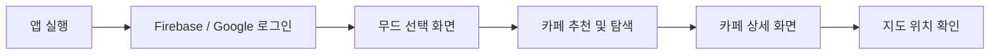

# ☕ MoodPlace — AI 기반 카페 추천 앱

> 오늘의 기분과 분위기에 맞는 카페를, 검색이 아닌 '무드'로 찾는 카페 탐색 앱

<p>
  
  
  
  
  
  
  
</p>

## 🖼️ 실행페이지

| 무드 선택 화면 | 지도 기반 탐색 | 소셜 로그인 |
|---|---|---|
|  |  |  |

배포 링크: https://moodplace001.vercel.app/ · 소개 페이지: https://tmdnd0568.github.io/site/ ([소개 페이지 저장소](https://github.com/tmdnd0568/site))

## 📖 소개

MoodPlace는 SNS의 세부 분위기·스타일 필터링 한계를 해결하기 위해 기획한 **무드(분위기) 기반 카페 검색 앱**입니다. 검색어나 지역명이 아니라 "지금 이 기분"에 맞는 무드를 기준으로 카페를 탐색할 수 있도록 만들었습니다. 디자인은 Figma와 AI 디자인 툴 **Stitch**를 함께 사용해 제작했습니다.

## ✨ 주요 기능 & 인터랙션

### 1. Firebase Authentication 기반 인증 및 소셜 로그인

Firebase Authentication을 이용하여 이메일 회원가입/로그인, 비밀번호 재설정 메일 발송, Google 소셜 로그인, 세션 유지 및 로그아웃 기능을 구현했습니다. 브라우저 저장소(localStorage)에는 비밀번호를 저장하지 않습니다.

Apple 로그인은 현재 준비 중입니다.

### 2. 지도 기반 카페 탐색 및 경로 미리보기

지도 페이지에서 카페의 위치를 확인할 수 있으며, 출발지와 목적지를 기준으로 이동 경로를 미리 확인할 수 있도록 구성했습니다.

GPS 위치를 사용할 수 없는 경우에는 기본 출발지를 명확하게 구분하여 표시하도록 처리했습니다.

### 3. 모바일 최적화 UX

모바일 브라우저에서 입력 시 화면이 자동으로 확대되는 현상을 방지하고, 모바일 화면 크기에 맞춰 주요 인터랙션과 레이아웃을 조정했습니다.

### 4. Gemini API 기반 무드 추천 & Fallback

사용자가 선택한 무드 태그와 텍스트 설명을 기반으로 Vercel Serverless Functions (`api/gemini.ts`)를 거쳐 Gemini API 추천 결과를 받아옵니다.

API Key는 서버 환경변수(`GEMINI_API_KEY`)로 관리하여 브라우저에 직접 노출되지 않도록 구성했습니다.

네트워크 또는 API 호출에 실패하더라도 fallback 추천 데이터를 제공해 앱 이용이 중단되지 않도록 처리했습니다.

## 🧭 사용자 플로우



## 🗂️ 폴더 구조

```text
moodplace/
├── api/                          # Vercel Serverless Functions (Gemini API 보안 처리)
├── public/                       # 정적 에셋
├── src/                          # 컴포넌트 · 페이지 · 서비스 · Firebase 설정
├── backup_original_publishing/   # 초기 퍼블리싱 백업
├── .oxlintrc.json
├── vite.config.ts                # Vite 설정
├── vercel.json                   # SPA 라우팅 및 Serverless 함수 설정
├── tsconfig.json
├── tsconfig.app.json
├── tsconfig.node.json
└── 작업계획.md
```

## 🤖 AI 활용 프로세스

디자인 단계에서 Figma와 AI 디자인 툴 Stitch를 함께 활용했습니다. 그 외 기획·개발·카피라이팅·트러블슈팅 단계에서도 AI를 초안 및 문제 해결 보조 도구로 활용하고, 결과를 직접 확인하고 수정하는 방식으로 프로젝트를 진행했습니다.

**① 기획 단계 — 무드 분류 기준 정의 및 큐레이션 수립**

분위기, 디저트, 작업·독서, 데이트, 전망 등 실제 카페 방문 목적을 기준으로 무드 태그를 정리하고, AI를 활용해 초기 분류 기준을 검토한 뒤 서비스 흐름에 맞게 수정했습니다.

**② 디자인 단계 — Figma × Stitch UX/UI 정돈**

AI 디자인 도구 Stitch를 활용해 초기 레이아웃 구조를 빠르게 구상한 뒤, Figma에서 컬러, 간격, 컴포넌트 배치 등을 수정하며 MoodPlace의 분위기에 맞게 UI를 정리했습니다.

**③ 개발 단계 — Firebase Authentication 및 서버리스 API 연동**

Firebase Authentication 기반으로 이메일 및 소셜 인증 기능을 구현하고, Gemini API Key가 브라우저에 직접 노출되지 않도록 Vercel Serverless Function을 이용한 API 통신 구조로 개선했습니다.

**④ 트러블슈팅 — 원인 진단 및 개선**

기능 구현 중 오류가 발생했을 때 AI를 활용해 원인 후보를 빠르게 확인한 뒤, 실제 코드와 동작을 직접 검증하며 문제 범위를 좁혀 수정했습니다.

## 🩹 트러블슈팅

| 이슈 | 원인 | 해결 |
|---|---|---|
| 모바일에서 입력 시 화면이 자동 확대됨 | 모바일 브라우저 입력 환경에서 발생하는 확대 현상 | 모바일 입력 환경에 맞게 뷰포트 및 입력 UI 조정 |
| 새로고침 시 라우트 404 발생 (SPA) | Vercel 기본 라우팅이 SPA 구조와 불일치 | `vercel.json`에 SPA 라우팅(rewrite) 설정 추가 |
| public 자막/텍스트 요소가 서로 겹쳐 보임 | 레이아웃 겹침 미보정 | 콘텐츠 레이아웃 수정으로 겹침 해결 |
| 환경변수 접두사 혼동 | 프로젝트 초기 환경변수 네이밍 불일치 | 환경변수 네이밍을 정리해 사용 위치를 명확하게 구분 |
| 클라이언트 Gemini API Key 노출 위험 | 프론트엔드 코드에서 API Key 직접 참조 | Vercel Serverless Function (`api/gemini.ts`)으로 API 호출 이동 |
| localStorage 비밀번호 저장 보안 위험 | 브라우저 저장소에 사용자 비밀번호 저장 | Firebase Authentication 중심으로 통합하고 비밀번호 localStorage 저장 완전 제거 |
| 외부 AI (Gemini) API 호출 실패 시 서비스 중단 | 네트워크 또는 API 오류 시 추천 결과를 제공할 수 없음 | API 실패 시 fallback 추천 데이터로 전환하여 앱 이용이 중단되지 않도록 처리 |

## 🧷 바로가기

- 깃허브: https://github.com/tmdnd0568/moodplace

- 노션: https://app.notion.com/p/Project-1-moodplace-AI-dfc1a4be835a83d49e2a0169a48b08cc?source=copy_link

- 피그마: https://www.figma.com/design/Y4NcodTo6r6uGdRLp7Ew0y/%ED%8F%AC%ED%86%A0%ED%8F%B4%EB%A6%AC%EC%98%A4-moodeplace?node-id=0-1&t=Ms2xl1KE8WzyIwEL-1

- 배포주소: https://moodplace001.vercel.app/

- 노트폴리오: https://notefolio.net/aivibe001/466150
