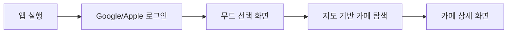

# ☕ MoodPlace — 무드 기반 카페 추천 앱

> 오늘의 기분과 분위기에 맞는 카페를, 검색이 아닌 '무드'로 찾는 카페 탐색 앱

<p>
  
  
  
  
  
  
  
</p>

## 🖼️ 데모
| 무드 선택 화면 | 지도 기반 탐색 | 소셜 로그인 |
|---|---|---|
| (스크린샷 삽입) | (스크린샷 삽입) | (스크린샷 삽입) |

배포 링크: https://moodplace001.vercel.app/ · 소개 페이지: https://tmdnd0568.github.io/site/ ([소개 페이지 저장소](https://github.com/tmdnd0568/site))

## 📖 소개
MoodPlace는 SNS의 세부 분위기·스타일 필터링 한계를 해결하기 위해 기획한 **무드(분위기) 기반 카페 검색 앱**입니다. 검색어나 지역명이 아니라 "지금 이 기분"에 맞는 무드를 기준으로 카페를 탐색할 수 있도록 만들었습니다. 디자인은 Figma와 AI 디자인 툴 **Stitch**를 함께 사용해 제작했습니다.

## ✨ 주요 기능 & 인터랙션

### 1. Google · Apple 소셜 로그인
회원가입 절차 없이 Google, Apple 계정으로 바로 로그인할 수 있도록 실제 연동을 완료했습니다. Firebase Authentication 기반으로 구현되어 있습니다.
> (구체적인 인증 흐름 — 로그인 후 리다이렉트 처리 방식 등 — 을 추가해주세요.)

### 2. 지도 기반 카페 탐색
지도 페이지에서 카테고리 탭으로 원하는 무드의 카페를 필터링하며 탐색할 수 있습니다. 최근 커밋에서 탭 정렬과 지도 페이지 UI를 개선했습니다.
> (탭 구성, 지도 마커/클러스터링 방식 등 구체적인 구현을 추가해주세요.)

### 3. 모바일 최적화 UX
모바일 브라우저에서 입력 시 뷰포트가 자동으로 확대(zoom)되는 문제를 방지하는 등, 모바일 환경에 맞춘 UX 디테일을 다듬었습니다.

### 4. (네 번째 핵심 기능 — 무드 기반 추천 로직 등)
> 무드 선택 → 카페 추천이 이어지는 핵심 로직의 구체적인 구현 방식을 추가해주세요.

## 🧭 사용자 플로우


## 🗂️ 폴더 구조
```
moodplace/
├── public/                       # 정적 에셋 (자막/텍스트 리소스 포함)
├── src/                          # 컴포넌트 · 지도 페이지 · Firebase 초기화
├── backup_original_publishing/   # 초기 퍼블리싱 백업
├── .oxlintrc.json
├── vite.config.ts                # 환경변수 prefix 설정
├── vercel.json                   # SPA 라우팅을 위한 Vercel 설정
├── tsconfig.json / tsconfig.app.json / tsconfig.node.json
└── 작업계획.md
```

## 🤖 AI 활용 프로세스
디자인 단계에서 Figma와 AI 디자인 툴 Stitch를 함께 활용했습니다. 그 외 기획·개발·카피라이팅·트러블슈팅 단계에서도 AI를 1차 초안 생성 도구로 활용하고, 결과를 검증·수정하는 방식으로 진행했습니다.

**① 기획 단계 — 무드 분류 기준 정의**
> 어떤 무드 태그를 기준으로 삼을지 정리할 때 사용한 프롬프트를 적어주세요.

**② 디자인 단계 — Figma × Stitch**
> 스티치로 디자인한것들의 디자인이 상당히 ai 느낌이 너무 강해 
필요없는 코너 레디오스 값, 쩅한 색상 텍스트 등을 수정하고 
로그인화면 제배치 작업을 하엿습니다.

**③ 개발 단계 — 소셜 로그인 · 지도 페이지 구현**
> env 파일에 api 키들을 받아 두었어 실제로 로그인버튼을 클릭하면 구글과 apple 로그인이 가능하게 구현해줘 

**⑤ 트러블슈팅 — 원인 진단**
버그가 발생했을 때도 증상을 설명해 원인 후보를 먼저 받아본 뒤, 실제 원인을 좁혀 나갔습니다. (아래 트러블슈팅 표 참고)

## 🩹 트러블슈팅
| 이슈 | 원인 | 해결 |
|---|---|---|
| 모바일에서 입력 시 화면이 자동 확대됨 | 뷰포트 auto-zoom 미차단 | 뷰포트 설정으로 모바일 auto-zoom 방지 |
| 새로고침 시 라우트 404 발생 (SPA) | Vercel 기본 라우팅이 SPA 구조와 불일치 | `vercel.json`에 SPA 라우팅(rewrite) 설정 추가 |
| public 자막/텍스트 요소가 서로 겹쳐 보임 | 레이아웃 겹침 미보정 | 콘텐츠 레이아웃 수정으로 겹침 해결 |
| 환경변수 접두사 혼동 | 프로젝트 초기 환경변수 네이밍 불일치 | 전역 환경변수 prefix 통일 리팩토링 |


## 🧷 바로가기
- 깃허브:https://github.com/tmdnd0568/moodplace

- 노션:https://app.notion.com/p/Project-1-moodplace-AI-dfc1a4be835a83d49e2a0169a48b08cc

- 피그마: https://www.figma.com/design/Y4NcodTo6r6uGdRLp7Ew0y/%ED%8F%AC%ED%86%A0%ED%8F%B4%EB%A6%AC%EC%98%A4-moodeplace?node-id=0-1&t=Ms2xl1KE8WzyIwEL-1

- 배포주소:https://arena-eta-five.vercel.app/

- 노트폴리오:https://notefolio.net/aivibe001/466150
